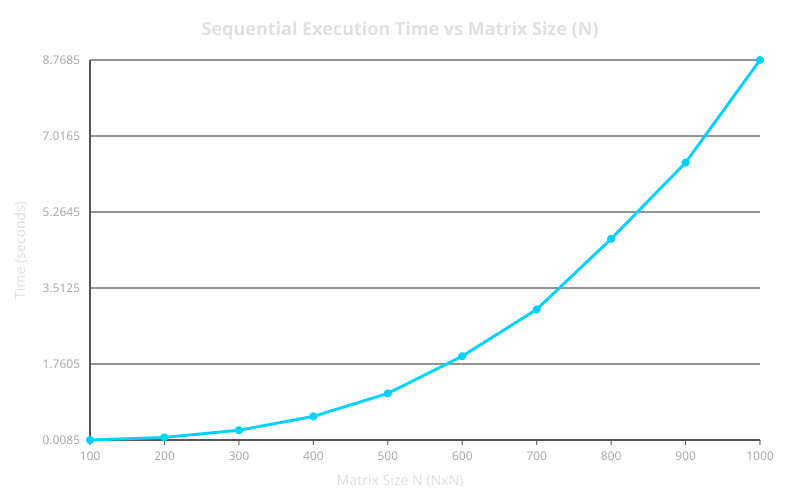
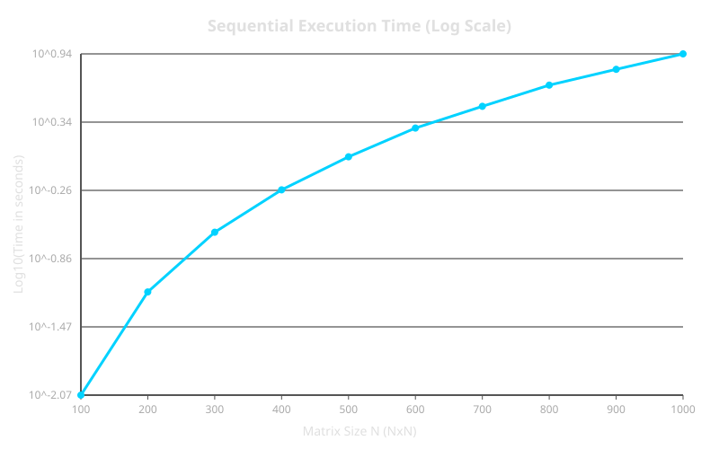
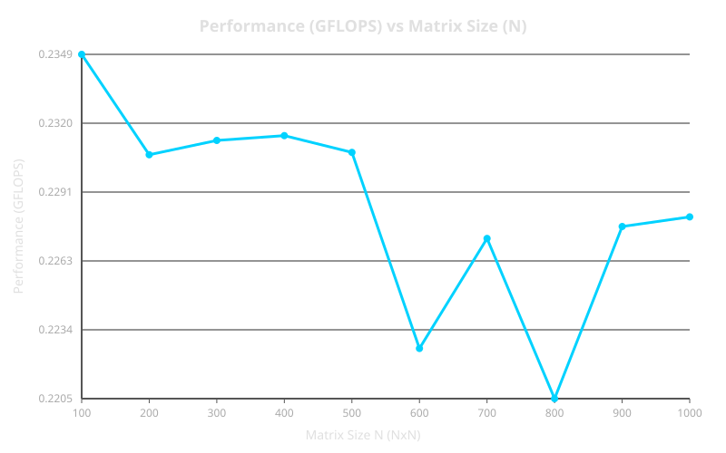

# Лабораторная работа 1 — последовательная версия

Архитектура, методика эксперимента, генерация данных, замер, верификация и агрегация описаны в [корневом README](../../README.md).

## 1. Цель работы

Задача — реализовать и измерить однопоточную версию программы для перемножения квадратных матриц, проверить корректность результатов на разных размерах данных с помощью стороннего инструмента (Python) и получить опорные показатели производительности, которые пригодятся в следующих лабораторных работах.

## 2. Алгоритм

Последовательное перемножение матриц реализовано со сменой порядка циклов на `i-k-j` для оптимизации работы с кэш-памятью:

```cpp
Matrix multiply(const Matrix& other) const {
    if (size != other.size) {
        throw std::invalid_argument("The matrix sizes do not match!");
    }

    Matrix result(size);

    // Порядок циклов i-k-j выбран для эффективности, помогает попадать в кэш.
    for (size_t i = 0; i < size; ++i) {
        for (size_t k = 0; k < size; ++k) {
            double temp = operator()(i, k);
            for (size_t j = 0; j < size; ++j) {
                result(i, j) += temp * other(k, j);
            }
        }
    }

    return result;
}
```

Алгоритм принимает две квадратные матрицы $A$ и $B$ размерностью $N \times N$, прочитанные из файлов (`matrixA.txt` и `matrixB.txt`), и вычисляет результирующую матрицу $C$, которая сохраняется в файл `matrixC_res.txt`.

Порядок циклов `i-k-j` выбран для обеспечения последовательного обращения к элементам в памяти (row-major order), что существенно повышает пространственную локальность данных и снижает число промахов кэша (L1/L2 cache misses) по сравнению с классическим порядком `i-j-k`.

Сложность алгоритма — $\mathcal{O}(N^3)$, так как требуется выполнить $2N^3$ операций с плавающей точкой (умножения и сложения). Пространственная сложность составляет $\mathcal{O}(N^2)$ для хранения элементов матриц в памяти.

Замеры времени фиксируют исключительно время работы функции `multiply()` через `std::chrono::high_resolution_clock`, исключая накладные расходы на файловый ввод-вывод.

## 3. Результаты

Все прогоны выполнялись на ПК с процессором **AMD Ryzen 7 7800X3D 8-Core Processor (4.20 GHz)** и **32 GB RAM**. Замеры проводились неоднократно на 10 различных объемах данных, чтобы исключить аномальные выбросы.

Все 10 прогонов прошли верификацию: максимальная абсолютная разность между C++ и Python не превысила $5,28 \times 10^{-7}$.

Таблица 1 — Фактические результаты из `results.csv`:

| size_code (N) | Размер матрицы | Время, сек | Производительность, GFLOPS | Макс. разность | T(2N)/T(N) |
| ------------: | -------------: | ---------: | -------------------------: | -------------: | ---------: |
|           100 |        100x100 |   0,008514 |                     0,2349 |       4.95e-07 |          — |
|           200 |        200x200 |   0,069341 |                     0,2307 |       5.04e-07 |       8,14 |
|           300 |        300x300 |   0,233480 |                     0,2313 |       5.06e-07 |          — |
|           400 |        400x400 |   0,552845 |                     0,2315 |       5.12e-07 |       7,97 |
|           500 |        500x500 |   1,083175 |                     0,2308 |       5.13e-07 |          — |
|           600 |        600x600 |   1,940281 |                     0,2226 |       5.15e-07 |       8,31 |
|           700 |        700x700 |   3,019703 |                     0,2272 |       5.18e-07 |          — |
|           800 |        800x800 |   4,644073 |                     0,2205 |       5.22e-07 |       8,40 |
|           900 |        900x900 |   6,402242 |                     0,2277 |       5.28e-07 |          — |
|          1000 |      1000x1000 |   8,768515 |                     0,2281 |       5.24e-07 |       8,09 |

Анализ по итогам 10 прогонов:

- суммарное время выполнения наибольшей задачи ($N = 1000$) составило **8,769 сек**;
- пиковая производительность — **≈0,235 GFLOPS**;
- среднее значение `T(2N)/T(N) ≈ 8,12`, что соответствует теоретическому росту $2^3 = 8$ при кубической сложности;
- пропускная способность остается стабильной на всем диапазоне размеров (колебания GFLOPS от 0,220 до 0,235).

## 4. Анализ графиков

### Время выполнения



Рисунок 1 — Время последовательного выполнения

График демонстрирует полиномиальный кубический рост ($\mathcal{O}(N^3)$). При увеличении размерности матрицы $N$ в 2 раза время выполнения возрастает примерно в 8 раз.



Рисунок 2 — Время последовательного выполнения в лог. шкале

В логарифмической шкале зависимость времени от размера задачи имеет вид прямой линии, что подтверждает стабильность алгоритмической сложности без резких провалов производительности.

### Производительность



Рисунок 3 — Производительность последовательной версии (GFLOPS)

График производительности демонстрирует стабильную планку около **~0,23 GFLOPS** на всем диапазоне размеров матриц, что говорит об отсутствии деградации при выходе за пределы малых объемов данных.

## 5. Выводы

1. Последовательная реализация перемножения матриц корректна: все 10 прогонов прошли верификацию, максимальная абсолютная разность с эталонным расчетом на Python не превышает $5,3 \times 10^{-7}$.
2. Экспериментально подтверждена кубическая сложность $\mathcal{O}(N^3)$: средний коэффициент масштабирования `T(2N)/T(N) ≈ 8,12`.
3. Базовый уровень производительности на процессоре **AMD Ryzen 7 7800X3D** составил **≈0,23 GFLOPS**. Это опорное значение для последующих лабораторных работ, относительно которого будет оцениваться ускорение при использовании параллельных технологий (OpenMP, MPI, CUDA).