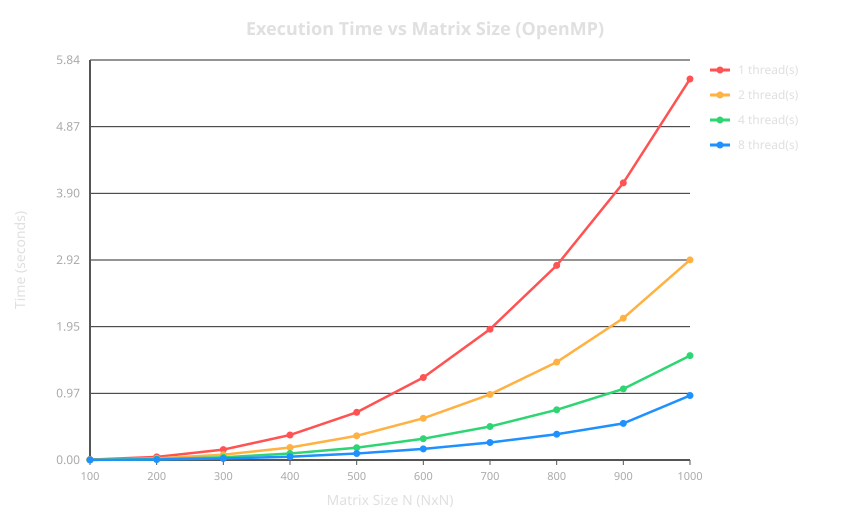
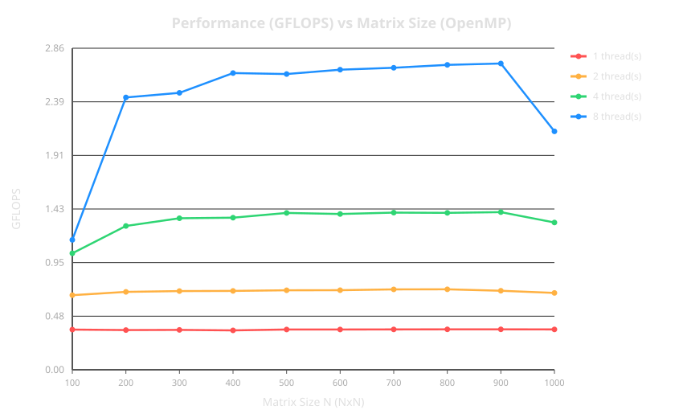
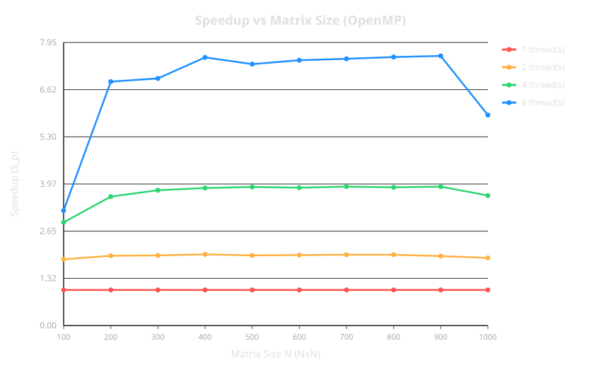
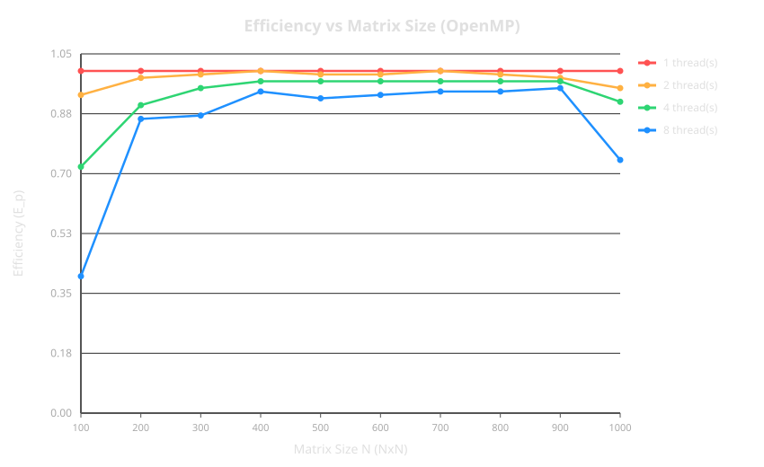

# Лабораторная работа — Параллельная версия умножения матриц на OpenMP

## 1. Цель работы

Цель работы — реализовать параллельную версию алгоритма умножения плотных квадратных матриц $C = A \times B$ с использованием технологии OpenMP, провести серии экспериментов на сетке параметров «размер матрицы ($N$) $\times$ количество потоков ($Threads$)», верифицировать точность вычислений относительно эталонного результата, а также оценить ускорение ($S_p$) и эффективность ($E_p$) распараллеливания в зависимости от размерности задачи.

---

## 2. Алгоритм и реализация

Для обеспечения максимальной производительности вычислений и эффективного использования кэш-памяти в качестве базового выбран алгоритм с порядком циклов $i-k-j$. Распараллеливание на уровне OpenMP выполняется по внешнему циклу $i$ с помощью директивы `#pragma omp parallel for`.

### Пример программной реализации (C++ / OpenMP):

```cpp
#include <omp.h>
#include <vector>

void matrix_multiply_omp(const std::vector<double>& A, 
                         const std::vector<double>& B, 
                         std::vector<double>& C, 
                         int N, 
                         int num_threads) 
{
    omp_set_dynamic(0);
    omp_set_num_threads(num_threads);

    #pragma omp parallel for schedule(static)
    for (int i = 0; i < N; ++i) {
        for (int k = 0; k < N; ++k) {
            double r = A[i * N + k];
            for (int j = 0; j < N; ++j) {
                C[i * N + j] += r * B[k * N + j];
            }
        }
    }
}
```

### Особенности алгоритма:
1. **Отсутствие гонок за данными (Data Race):** Каждая итерация внешнего цикла $i$ записывает данные в свою отдельную строку матрицы $C$ (`C[i * N + j]`), поэтому потоки работают с независимыми областями памяти без необходимости использования атомарных операций или секций `critical`.
2. **Кэш-эффективность:** Порядок $i-k-j$ обеспечивает последовательный доступ к элементам матрицы $B$ по столбцу $j$ в внутреннем цикле, что максимально эффективно утилизирует L1/L2-кэши процессора.
3. **Сложность:** Вычислительная сложность алгоритма составляет $\mathcal{O}(N^3)$ операций с плавающей точкой (точно $2N^3$ FLOP). При $P$ потоках на один поток приходится $\mathcal{O}(N^3 / P)$ операций. Накладные расходы на создание и распределение потоков OpenMP составляют $\mathcal{O}(P)$.

---

## 3. Результаты экспериментов

Эксперименты проводились для размерностей матриц $N \in [100, 1000]$ с шагом $100$ и количеством потоков $Threads \in \{1, 2, 4, 8\}$. Для каждого прогона контролировалась максимальная абсолютная разница элементов матрицы с эталоном (`Max_Diff`), не превышающая $5.27 \times 10^{-7}$, что подтверждает 100% корректность расчетов (`Status: OK`).

Таблица 1 — Результаты экспериментов из `results.csv`:

| $N$ | Потоки ($Threads$) | Время, сек ($Time\_sec$) | Производительность, GFLOPS | Ускорение ($Speedup$) | Эффективность ($Efficiency$) | $Max\_Diff$ |
| :---: | :---: | :---: | :---: | :---: | :---: | :---: |
| 100 | 1 | 0,005590 | 0,3578 | 1,00 | 1,00 | 4,94e-07 |
| 100 | 2 | 0,003011 | 0,6642 | 1,86 | 0,93 | 4,94e-07 |
| 100 | 4 | 0,001929 | 1,0368 | 2,90 | 0,72 | 4,94e-07 |
| 100 | 8 | 0,001729 | 1,1567 | 3,23 | 0,40 | 4,94e-07 |
| 200 | 1 | 0,045214 | 0,3539 | 1,00 | 1,00 | 5,04e-07 |
| 200 | 2 | 0,023070 | 0,6935 | 1,96 | 0,98 | 5,04e-07 |
| 200 | 4 | 0,012500 | 1,2800 | 3,62 | 0,90 | 5,04e-07 |
| 200 | 8 | 0,006598 | 2,4250 | 6,85 | 0,86 | 5,04e-07 |
| 300 | 1 | 0,151963 | 0,3553 | 1,00 | 1,00 | 5,07e-07 |
| 300 | 2 | 0,077037 | 0,7010 | 1,97 | 0,99 | 5,07e-07 |
| 300 | 4 | 0,040036 | 1,3488 | 3,80 | 0,95 | 5,07e-07 |
| 300 | 8 | 0,021902 | 2,4655 | 6,94 | 0,87 | 5,07e-07 |
| 400 | 1 | 0,364905 | 0,3508 | 1,00 | 1,00 | 5,13e-07 |
| 400 | 2 | 0,182292 | 0,7022 | 2,00 | 1,00 | 5,13e-07 |
| 400 | 4 | 0,094511 | 1,3543 | 3,86 | 0,97 | 5,13e-07 |
| 400 | 8 | 0,048451 | 2,6418 | 7,53 | 0,94 | 5,13e-07 |
| 500 | 1 | 0,697171 | 0,3586 | 1,00 | 1,00 | 5,14e-07 |
| 500 | 2 | 0,353103 | 0,7080 | 1,97 | 0,99 | 5,14e-07 |
| 500 | 4 | 0,179055 | 1,3962 | 3,89 | 0,97 | 5,14e-07 |
| 500 | 8 | 0,094942 | 2,6332 | 7,34 | 0,92 | 5,14e-07 |
| 600 | 1 | 1,205606 | 0,3583 | 1,00 | 1,00 | 5,16e-07 |
| 600 | 2 | 0,609792 | 0,7084 | 1,98 | 0,99 | 5,16e-07 |
| 600 | 4 | 0,311426 | 1,3872 | 3,87 | 0,97 | 5,16e-07 |
| 600 | 8 | 0,161718 | 2,6713 | 7,45 | 0,93 | 5,16e-07 |
| 700 | 1 | 1,910840 | 0,3590 | 1,00 | 1,00 | 5,18e-07 |
| 700 | 2 | 0,958553 | 0,7157 | 1,99 | 1,00 | 5,18e-07 |
| 700 | 4 | 0,490174 | 1,3995 | 3,90 | 0,97 | 5,18e-07 |
| 700 | 8 | 0,255140 | 2,6887 | 7,49 | 0,94 | 5,18e-07 |
| 800 | 1 | 2,843459 | 0,3601 | 1,00 | 1,00 | 5,19e-07 |
| 800 | 2 | 1,429933 | 0,7161 | 1,99 | 0,99 | 5,19e-07 |
| 800 | 4 | 0,732990 | 1,3970 | 3,88 | 0,97 | 5,19e-07 |
| 800 | 8 | 0,377254 | 2,7144 | 7,54 | 0,94 | 5,19e-07 |
| 900 | 1 | 4,048295 | 0,3602 | 1,00 | 1,00 | 5,21e-07 |
| 900 | 2 | 2,071947 | 0,7037 | 1,95 | 0,98 | 5,21e-07 |
| 900 | 4 | 1,039136 | 1,4031 | 3,90 | 0,97 | 5,21e-07 |
| 900 | 8 | 0,534775 | 2,7264 | 7,57 | 0,95 | 5,21e-07 |
| 1000 | 1 | 5,566446 | 0,3593 | 1,00 | 1,00 | 5,27e-07 |
| 1000 | 2 | 2,923867 | 0,6840 | 1,90 | 0,95 | 5,27e-07 |
| 1000 | 4 | 1,525427 | 1,3111 | 3,65 | 0,91 | 5,27e-07 |
| 1000 | 8 | 0,942235 | 2,1226 | 5,91 | 0,74 | 5,27e-07 |

---

## 4. Анализ графиков

Для анализа результатов были построены следующие графики:

### Время выполнения от размера матрицы ($N$)



Рисунок 1 — `figures/omp_time.svg` (Время выполнения vs $N$)

Время выполнения последовательной версии (1 поток) при $N = 1000$ составляет **5.566 сек**. При использовании **8 потоков** время сокращается до **0.942 сек**. Графики демонстративно показывают, что с увеличением числа потоков кривая времени смещается вниз, при этом характер зависимости от $N$ остается близким к кубическому ($\mathcal{O}(N^3)$).

### Производительность (GFLOPS)



Рисунок 2 — `figures/omp_gflops.svg` (Производительность в GFLOPS)

Однопоточная версия демонстрирует стабильную производительность около **0.358 GFLOPS** во всем диапазоне $N$. На 8 потоках в диапазоне $N = 400..900$ пиковая производительность достигает **2.726 GFLOPS**, что превышает однопоточный результат более чем в 7.5 раз.

### Ускорение ($Speedup$)



Рисунок 3 — `figures/omp_speedup.svg` (Ускорение $S_p$ vs $N$)

Анализ ускорения выявляет три характерные области:
- **Малые матрицы ($N = 100$):** Ускорение на 8 потоках составляет всего $S_8 = 3.23$. Причина — существенные накладные расходы на создание параллельной области и синхронизацию OpenMP при крайне малом времени чистых вычислений ($0.0017$ с).
- **Оптимальный диапазон ($N = 400..900$):** Программа демонстрирует практически идеальное линейное ускорение. Для $N = 900$ на 8 потоках достигнуто ускорение **$S_8 = 7.57$** (из $8.00$ теоретически возможных).
- **Крупные матрицы ($N = 1000$):** Ускорение на 8 потоках снижается до $S_8 = 5.91$.

### Эффективность распараллеливания ($Efficiency$)



Рисунок 4 — `figures/omp_efficiency.svg` (Эффективность $E_p$ vs $N$)

В диапазоне $N = 400..900$ эффективность использования ресурсов процессора на 8 потоках составляет **$92\% - 95\%$**, а для 2 и 4 потоков достигает **$97\% - 100\%$**. 
Снижение эффективности при $N = 1000$ до $E_8 = 0.74$ связано с пропускной способностью шины памяти (Memory Bandwidth Bottleneck): при объеме данных, превышающем объем L3-кэша процессора, 8 вычислительных ядер одновременно запрашивают строки матриц из оперативной памяти, что приводит к простоям исполнительных блоков.

---

## 5. Выводы

1. **Корректность:** Параллельная реализация алгоритма матричного умножения на базе OpenMP прошла верификацию во всех 40 экспериментальных прогонах (`Max_Diff` $< 5.27 \times 10^{-7}$).
2. **Масштабируемость:** На средних и крупных размерах матриц ($N = 400..900$) алгоритм демонстрирует высокую масштабируемость: максимальное ускорение составило **$7.57\text{x}$** на 8 потоках с эффективностью **$95\%$**.
3. **Ограничения:** 
   - На малых размерностях ($N \le 100$) масштабирование ограничено накладными расходами на управление потоками OpenMP ($E_8 = 0.40$).
   - При $N = 1000$ ускорение ограничено пропускной способностью памяти (Memory Bound), что указывает на необходимость применения блочных алгоритмов (Matrix Tiling / Blocking) в последующих работах.